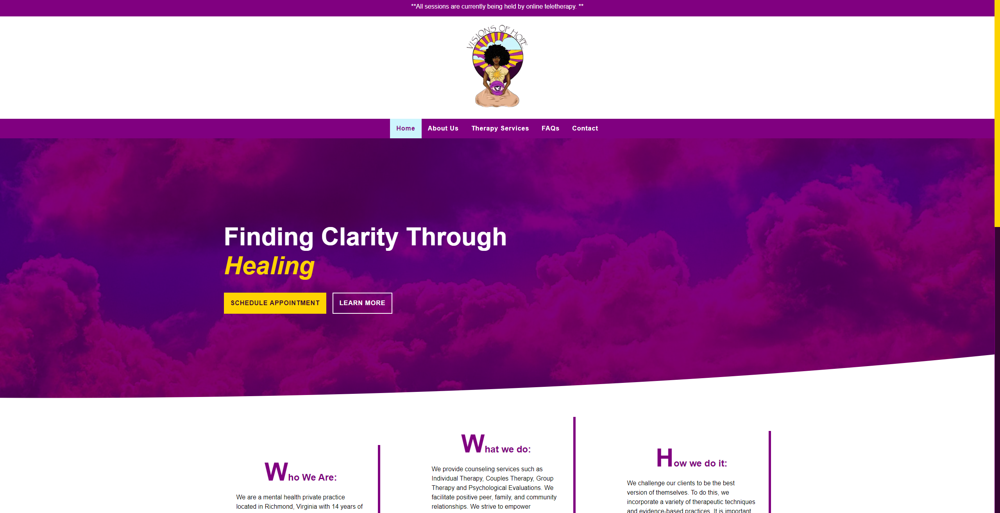

# VOHPS-LLC Rebrand

##  Table of contents

- [Overview](#overview)
  - [Screenshot](#screenshot)
  - [Links](#links)
- [My process](#my-process)
  - [Built with](#built-with)
  - [What I learned](#what-i-learned)
  - [Continued development](#continued-development)
- [Author](#author)

## Overview

This is a rebuild/rebranding for a previous freelance website I built for Visions of Hope Psychological Services, LLC.  They are a local private practice based in Richmond, Virginia that needed to create their online presence as well as generate leads and provide current and potential clients with a space to learn more information about their private practice.  They changed their logo and wanted a new look for their site that would compliment it.  To allow for future additions/upgrades I decided to build this using Next.js to accomodate a possible addition of a blog in the future.

### Screenshot

- Desktop Screenshot: 

- Mobile Screenshot: 

    

### Links

- Live site URL: [https://vohps-next.vercel.app/](https://vohps-next.vercel.app/)
- Github Repository URL: [https://github.com/artsycoder533/vohps-next.git](https://github.com/artsycoder533/vohps-next.git)

## My Process

I learned the differences between React and Next.Js.  This website was initially build with html, sass, and javascript.  To facilitate scaling, I decided to build the rebranded site in React.  I then learned that when you build a site with React its actually bad for SEO, so I started to look into Next.Js.  I noticed that there were quite a few similarities between the two so I decided to rebuild the site yet again, but this time with Next.Js. 

### Built With

- Next.js
- Styled Components

### What I learned

 - Problem: How do you add styling to an active link?
 - Solution: 
    - You have to import useRouter from 'next/router'.  This has a property called pathname which is the value of the url of page that you are currently one.  You can pass this value as a prop to your styled component and use that value compared to the url of all of the links in the navbar.  I used conditional styling, so that if these two values are a match, that means that is the active page so it gets different styling.

        In Navbar.js

        `<StyledLink path={router.pathname} href={url}>{text}</StyledLink>`

        In the accompanying style file

        `background: ${({ path, href }) => (path === href ? "#cdf5fd" : "purple")};
        color: ${({ path, href }) => (path === href ? "purple" : "white")};`

- Problem:  Why is my background image not showing up?
- Solution: 
    - In the styled components file you have to import the image and then pass whatever you named that import as a prop to the style property that will have that image as its background image.  I realized that I had to target the source property of the import which is equal to the path where its located, once I did this the image was shown.

        `import heroImg from '../../public/images/hero3.jpg';`

        `background: url(${heroImg.src}) center / cover no-repeat;`

- Problem:  What path do I use for the og:image meta tags?
- Solution:  At first I had the public folder in the path for the og:image and couldnt figure out why I wasnt showing up.  I read on Stackoverflow that you actually dont add the public folder in the path.
    - `<meta
          property="og:image"
          content="https://vohps-next.vercel.app/images/desktop.png"
        />`

- Problem: How do I add a custom icon to the title bar?
- Solution:
    - This path should be relative starting with the folder that contains the image
    `<link rel="icon" type="image" href="/images/logo.png"></link>`

### Continued Development

I would like to learn more about the backend so that I can incoporate a blog to this website.  In the meantime, I will continue to perform on-going updates to this website at the clients request.

## Author

- Portfolio - [https://natashajohnson.dev/](https://natashajohnson.dev/)

